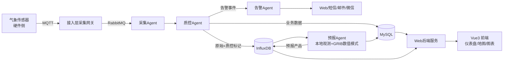

# 气象观测站嵌入式数据采集与 Web 预报系统 — 需求规格说明书（SRS）

| 文档属性 | 内容 |
|---|---|
| 版本 | v1.0 |
| 阶段 | 项目设计阶段 |
| 编写日期 | 2026-09-16 |
| 状态 | 初稿 |

---

## 1. 引言

### 1.1 目的
本文档明确系统的功能需求与非功能需求，作为后续架构设计、数据库设计、接口设计和开发测试的依据。

### 1.2 范围
系统覆盖从设备数据接入、数据处理、智能预报到 Web 展示与服务的完整链条。气象传感器等硬件设备由其他老师负责，本系统边界从**接入层（MQTT / 自动站协议）**开始。

### 1.3 术语定义

| 术语 | 定义 |
|---|---|
| 站点（Station） | 布设于校园/农田/区域的一个气象观测点，包含一或多台设备 |
| 气象要素 | 温度、湿度、气压、风速、风向、雨量、辐射、能见度、蒸发量等观测量 |
| 短临预报 | 0–72 小时内的精细化天气预报 |
| 质控（QC） | 数据质量检验与缺测插补 |
| GRIB | 数值天气预报产品的二进制标准格式 |

---

## 2. 用户角色与权限

| 角色 | 说明 | 主要权限 |
|---|---|---|
| 游客（GUEST） | 未登录用户 | 查看实时数据、地图、公开预报、科普内容 |
| 普通用户（USER） | 注册用户 | 历史查询、图表分析、数据下载（限流）、订阅告警 |
| 运维人员（OPERATOR） | 站点运维 | 设备档案、运维记录、质控人工审核、数据补录 |
| 预报员（FORECASTER） | 专业用户 | 预报产品查看与订正、告警规则维护、报表 |
| 管理员（ADMIN） | 系统管理 | 用户/角色/权限、站点管理、系统参数、操作日志 |

---

## 3. 功能需求

需求编号规则：`FR-<模块>-<序号>`。优先级：P0 必须 / P1 重要 / P2 可选。

### 3.1 实时气象监测模块（FR-RT）

| 编号 | 需求 | 优先级 |
|---|---|---|
| FR-RT-01 | GIS 地图展示站点分布，站点图标颜色反映最新数据状态（正常/告警/离线） | P0 |
| FR-RT-02 | 实时数据仪表盘：温湿度、风速风向、气压、雨量、辐射的当前值与仪表展示 | P0 |
| FR-RT-03 | 气象要素实时曲线（最近 24h），30 秒内自动刷新 | P0 |
| FR-RT-04 | 多站点数据对比视图（同要素多站点并列曲线） | P1 |
| FR-RT-05 | 站点离线检测：超过 N 分钟（可配置）无数据上报标记离线并通知 | P0 |

### 3.2 数据采集与质控 Agent 模块（FR-QC）

| 编号 | 需求 | 优先级 |
|---|---|---|
| FR-QC-01 | 定时自动采集分钟级/小时级数据（MQTT 订阅 + 定时轮询兜底） | P0 |
| FR-QC-02 | 极值检查：要素值超出物理/气候极值范围标记为可疑 | P0 |
| FR-QC-03 | 时间一致性检查：要素变化率超阈值标记可疑 | P0 |
| FR-QC-04 | 空间一致性检查：与邻近站点同时刻数据偏差过大标记可疑 | P1 |
| FR-QC-05 | 缺测数据智能插补（线性插值/邻近站点回归），插补数据须带标记 | P0 |
| FR-QC-06 | 可疑数据进入人工审核队列，运维人员可确认/修正/删除 | P1 |

### 3.3 精细化预报模块（FR-FC）

| 编号 | 需求 | 优先级 |
|---|---|---|
| FR-FC-01 | 结合本地观测与数值预报模式（GRIB 产品），生成 0–72h 站点级预报 | P0 |
| FR-FC-02 | 预报要素：气温、降水、风速风向、湿度 | P0 |
| FR-FC-03 | 预报产品可视化：逐小时/逐 3h 曲线、降水色斑图 | P1 |
| FR-FC-04 | 预报准确率检验：与实况对比的 MAE/RMSE/降水 TS 评分 | P1 |
| FR-FC-05 | 预报员人工订正并留痕 | P2 |

### 3.4 灾害告警 Agent 模块（FR-AL）

| 编号 | 需求 | 优先级 |
|---|---|---|
| FR-AL-01 | 多阈值告警规则配置：暴雨、大风、高温、寒潮、冰雹等要素阈值 | P0 |
| FR-AL-02 | 告警等级划分（蓝/黄/橙/红）与持续触发时的等级升级机制 | P0 |
| FR-AL-03 | 多渠道推送：Web 站内信、短信、邮件、微信 | P0（短信/微信可后置） |
| FR-AL-04 | 告警历史查询与统计（按类型/等级/站点/时间） | P0 |
| FR-AL-05 | 预警信号在地图与仪表盘上的可视化展示 | P1 |

### 3.5 数据查询与统计模块（FR-DS）

| 编号 | 需求 | 优先级 |
|---|---|---|
| FR-DS-01 | 多条件组合查询：站点、要素、时间范围、时间粒度（分钟/小时/日） | P0 |
| FR-DS-02 | 日/月/年统计报表：均值、最大/最小及出现时间 | P0 |
| FR-DS-03 | 极值统计与气候平均值（同期多年均值）对比 | P1 |
| FR-DS-04 | 数据导出：Excel / CSV / TXT | P0 |
| FR-DS-05 | 数据共享接口：按 Token 授权的开放 API | P2 |

### 3.6 气象服务模块（FR-WS）

| 编号 | 需求 | 优先级 |
|---|---|---|
| FR-WS-01 | 农业气象服务：作物生长期预报、病虫害发生气象条件提示 | P1 |
| FR-WS-02 | 旅游气象服务与出行指数预报（穿衣、洗车、晨练等） | P1 |
| FR-WS-03 | 科普宣传内容管理（富文本发布/上下架） | P2 |

### 3.7 站点与系统管理模块（FR-SM）

| 编号 | 需求 | 优先级 |
|---|---|---|
| FR-SM-01 | 站点档案：基本信息、经纬度、海拔、设备清单、投运日期 | P0 |
| FR-SM-02 | 设备运维记录：检定、维修、更换备件 | P1 |
| FR-SM-03 | 用户/角色/权限管理（RBAC） | P0 |
| FR-SM-04 | 系统参数配置（采集频率、离线阈值、质控阈值等） | P0 |
| FR-SM-05 | 操作日志记录与查询 | P0 |

---

## 4. 非功能需求

### 4.1 性能（NFR-P）

| 编号 | 需求 |
|---|---|
| NFR-P-01 | 实时数据从上报到 Web 展示延迟 ≤ 5 秒 |
| NFR-P-02 | 历史查询接口响应：单站点单要素 1 年小时数据 ≤ 2 秒 |
| NFR-P-03 | 支持不少于 50 个站点并发上报，单站点分钟级数据 |
| NFR-P-04 | 仪表盘页面首屏加载 ≤ 3 秒 |

### 4.2 可用性与可靠性（NFR-A）

| 编号 | 需求 |
|---|---|
| NFR-A-01 | 系统年可用率 ≥ 99.5% |
| NFR-A-02 | 气象时序数据保留 ≥ 5 年（InfluxDB + 冷数据归档） |
| NFR-A-03 | 采集链路故障时消息不丢失（MQTT QoS1 + 本地缓存重发） |
| NFR-A-04 | 数据库每日备份，支持恢复演练 |

### 4.3 安全性（NFR-S）

| 编号 | 需求 |
|---|---|
| NFR-S-01 | 基于 JWT 的无状态认证，Spring Security 实现 RBAC 授权 |
| NFR-S-02 | 密码 BCrypt 加密存储；敏感配置不落库 |
| NFR-S-03 | 接口防越权：站点级数据权限校验 |
| NFR-S-04 | 防止 SQL 注入（参数化查询）、XSS、CSRF |
| NFR-S-05 | 操作日志与登录日志审计 |

### 4.4 可扩展性与可维护性（NFR-X）

| 编号 | 需求 |
|---|---|
| NFR-X-01 | 新增气象要素只需配置，不改核心代码 |
| NFR-X-02 | 新增站点即插即用，自动注册数据流 |
| NFR-X-03 | Agent 间通过消息队列解耦，可独立扩容 |
| NFR-X-04 | 前后端分离，API 遵循统一 RESTful 规范 |

### 4.5 兼容性（NFR-C）

| 编号 | 需求 |
|---|---|
| NFR-C-01 | 支持主流现代浏览器（Chrome/Edge/Firefox 最近两个大版本） |
| NFR-C-02 | 移动端 H5 自适应展示 |

---

## 5. 数据流与核心用例

---

## 6. 验收标准（摘要）

1. 五大 Agent 全链路跑通：采集 → 质控 → 存储 → 预报 → 告警推送。
2. 全部 P0 功能需求通过功能测试与集成测试。
3. 关键性能指标（NFR-P）通过压测验证。
4. 提供完整的接口文档（Swagger/OpenAPI 在线可查）。

---

## 附录 A：待确认事项

| 事项 | 说明 |
|---|---|
| 微信/短信通道 | 是否申请公众号/短信服务商资源，影响 FR-AL-03 交付形态 |
| GRIB 数据源 | 使用何种数值预报模式产品（如欧洲中心/GFS），影响预报 Agent 数据接入设计 |
| 多站点规模 | 实际站点数量与最终部署环境 |
