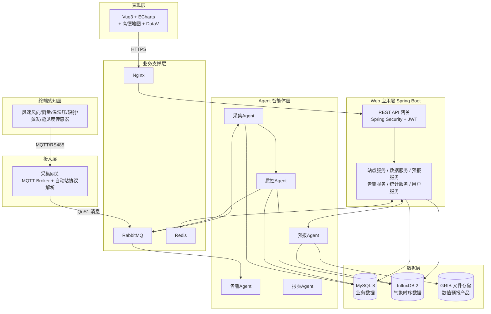

# 气象观测站嵌入式数据采集与 Web 预报系统 — 系统架构设计

| 文档属性 | 内容 |
|---|---|
| 版本 | v1.0 |
| 编写日期 | 2026-09-16 |
| 关联文档 | [01-SRS-需求规格说明书](./01-SRS-需求规格说明书.md) |

---

## 1. 架构总览

系统采用七层架构，自上而下为：**表现层 → Web 应用层 → Agent 智能体层 → 业务支撑层 → 数据层 → 接入层 → 终端感知层**。各层松耦合，通过明确定义的接口与消息协议通信。



---

## 2. 各层职责与技术选型

### 2.1 表现层

| 项 | 说明 |
|---|---|
| 技术栈 | Vue 3 + Vite + Pinia + ECharts + 高德地图 JS API + DataV |
| 职责 | 实时监测仪表盘、GIS 站点地图、历史查询与图表分析、预报产品可视化、告警展示、系统管理后台 |
| 交互方式 | REST（拉）+ WebSocket（推：实时数据、告警弹窗） |

### 2.2 Web 应用层

| 项 | 说明 |
|---|---|
| 技术栈 | Java 17 + Spring Boot 3.x + Spring Security + MyBatis Plus + springdoc-openapi |
| 职责 | 六大服务：站点管理、数据服务、预报服务、告警服务、统计服务、用户服务 |
| 关键设计 | 无状态 JWT 认证；统一异常处理与响应封装；读写分离视图（时序查询走 InfluxDB，业务查询走 MySQL） |

### 2.3 Agent 智能体层

| 项 | 说明 |
|---|---|
| 技术栈 | Spring AI + LangChain4j + 时间序列预测模型（先基线：ARIMA/Prophet，后迭代 LSTM） |
| 职责 | 见 2.3.1 五大 Agent 设计 |

#### 2.3.1 五大 Agent 设计

| Agent | 触发方式 | 输入 | 输出 | 核心逻辑 |
|---|---|---|---|---|
| 采集 Agent | MQTT 消息驱动 + 分钟级定时兜底 | 原始报文（JSON/二进制） | 标准化观测数据 → MQ | 协议解析、单位归一、站点识别、写入 InfluxDB |
| 质控 Agent | 订阅采集 Agent 输出 | 原始观测数据 + 阈值配置 | 质控标记数据、插补数据、可疑数据审核任务 | 极值/时间一致性/空间一致性检验、缺测插补 |
| 预报 Agent | 定时（逐小时）+ 手动触发 | 本地实况 + GRIB 数值产品 | 0–72h 逐小时/逐 3h 预报产品 | 降尺度订正 + ML 短临模型，输出并回写 InfluxDB，计算检验评分 |
| 告警 Agent | 订阅质控后数据流 | 实时数据 + 告警规则 | 告警事件 → MQ | 阈值判定、等级升级、去重抑制、多渠道分发 |
| 报表 Agent | 定时（日/月/年） | InfluxDB 历史数据 | 统计报表记录 + 导出文件 | 均值/极值统计、气候均值对比、生成 Excel |

#### 2.3.2 Agent 协作消息流

```
topic.meteo.raw        采集Agent → 质控Agent     原始标准化数据
topic.meteo.qc         质控Agent → 告警Agent     质控后数据
topic.alert.trigger    告警Agent → 通知服务      告警事件
topic.forecast.ready   预报Agent → Web应用层     预报产品就绪（触发 WebSocket 推送）
```

> 报表 Agent 不参与上述消息流：其输入为 InfluxDB 历史数据、触发方式为定时（日/月/年），
> 无需订阅实时质控流。原先为它绑定的 `queue.meteo.qc.report` 因长期无消费者造成消息单向
> 堆积，已移除该队列与绑定。

### 2.4 业务支撑层

| 组件 | 用途 |
|---|---|
| RabbitMQ | Agent 间异步解耦；MQTT 上行数据进入 `meteo.raw` 队列；告警事件分发。消息 QoS1，手动 ack |
| Redis | 实时数据缓存（站点最新一条，供仪表盘高频读取）、登录 Token 黑名单、接口限流计数、分布式锁 |
| Nginx | HTTPS 终结、静态资源（Vue 构建产物）、反向代理 `/api` → Spring Boot 集群、WebSocket 升级代理 |

### 2.5 数据层

| 存储 | 存放内容 | 说明 |
|---|---|---|
| MySQL 8 | 站点/设备档案、用户权限、告警规则与记录、质控审核任务、报表记录、操作日志 | 业务强一致数据 |
| InfluxDB 2 | 气象观测时序（measurement：`obs_min`、`obs_hour`）、预报产品（`fcst`） | 按 station_id 建 tag，保留策略 5 年 |
| GRIB 存储 | 数值预报模式原始产品文件（本地磁盘/对象存储） | 文件级管理，路径入库索引 |

### 2.6 接入层

| 项 | 说明 |
|---|---|
| 协议 | MQTT 3.1.1/5.0（主）、自动站串口协议透传（经采集器网关转 MQTT） |
| 报文 | 上行 JSON：`{stationCode, deviceId, ts, elements:{temp, humi, pres, windSpeed, windDir, rain, rad, vis, evap}, raw}` |
| 安全 | 设备级 username/password + topic ACL |
| 上报频率 | 分钟级（正点前 1 分钟校时上报）、小时整点报 |

### 2.7 终端感知层

各类气象传感器、数据采集器、供电通讯模块——**由其他老师负责**，本系统以 MQTT 接入规范为对接契约（见接入层报文定义）。

---

## 3. 关键横切设计

### 3.1 认证与授权
- 登录颁发 JWT（access 2h + refresh 7d），Redis 管理 refresh Token。
- Spring Security 过滤器链校验；RBAC 五角色（见 SRS 第 2 章）。

### 3.2 异常与响应
- 全局 `@RestControllerAdvice` 统一异常处理。
- 统一响应结构 `{code, message, data, timestamp}`（详见 API 规范文档）。

### 3.3 配置管理
- `application.yml` + 环境隔离（dev/test/prod）；敏感配置经环境变量注入。

### 3.4 可观测性
- Spring Boot Actuator + Micrometer；关键链路日志带 traceId（MQTT msgId 贯穿采集→质控→告警）。

### 3.5 部署拓扑（初期单机）

```
Nginx (80/443)
 ├── /  → Vue 静态资源
 └── /api → Spring Boot :8080
RabbitMQ :5672 / Redis :6379
MySQL :3306 / InfluxDB :8086 / EMQX(MQTT) :1883
```

---

## 4. 技术选型清单汇总

| 层 | 组件 | 版本基线 |
|---|---|---|
| 前端 | Vue / ECharts / 高德 / DataV | Vue 3.4+ / ECharts 5 |
| 后端 | Spring Boot / Security / MyBatis Plus | 3.2+ / 3.2 / 3.5 |
| AI | Spring AI / LangChain4j | 1.0 / 1.0 |
| 中间件 | RabbitMQ / Redis / Nginx / EMQX | 3.12 / 7 / 1.24 / 5.x |
| 数据 | MySQL / InfluxDB | 8.0 / 2.7 |
| 构建 | Maven / Node | 3.9+ / 20 LTS |
| JDK | Java | 17 |
