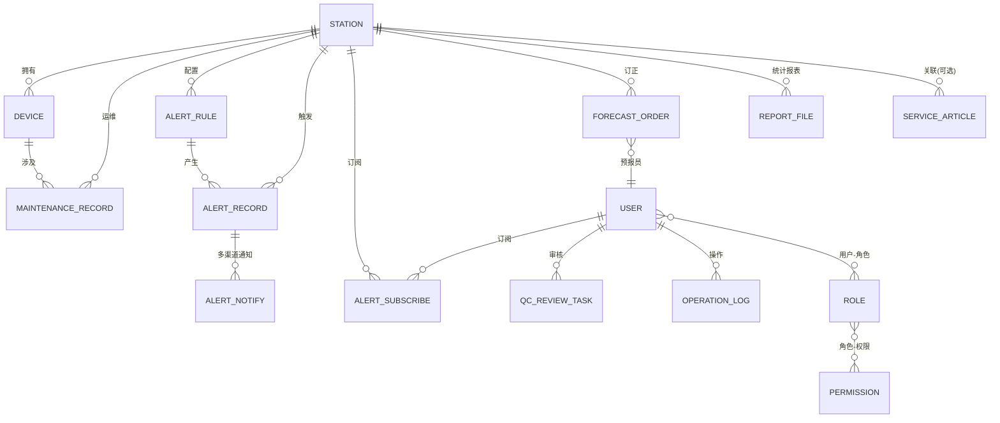

# 气象观测站嵌入式数据采集与 Web 预报系统 — 数据库 ER 模型设计

| 文档属性 | 内容 |
|---|---|
| 版本 | v1.0 |
| 编写日期 | 2026-09-16 |
| 存储分工 | MySQL 存业务数据（本文档第 2–4 章）；InfluxDB 存时序数据（第 5 章） |

---

## 1. 设计约定

- 表名/字段名使用小写下划线命名（snake_case）。
- 所有表含公共字段：`id BIGINT AUTO_INCREMENT PRIMARY KEY`、`create_time`、`update_time`、逻辑删除 `deleted TINYINT DEFAULT 0`。
- 字典值（状态、等级等）用 TINYINT/枚举，含义在注释中说明。
- 时间统一使用 `DATETIME`（东八区），入库前由服务端统一生成。

---

## 2. ER 模型总图（MySQL）

---

## 3. 核心表结构定义

### 3.1 站点与设备域

#### station（气象站点）

| 字段 | 类型 | 说明 |
|---|---|---|
| station_code | VARCHAR(32) UK | 站点编码（MQTT 上报标识） |
| name | VARCHAR(64) | 站点名称 |
| province / city / district | VARCHAR(32) | 行政区划 |
| longitude / latitude | DECIMAL(10,6) | 经纬度（高德 GCJ-02） |
| altitude | DECIMAL(7,2) | 海拔（米） |
| station_type | TINYINT | 1校园 2农业 3区域 |
| status | TINYINT | 0停用 1正常 2维护中 |
| online_flag | TINYINT | 0离线 1在线（采集 Agent 心跳维护） |
| last_report_time | DATETIME | 最后上报时间 |
| commission_date | DATE | 投运日期 |

#### device（观测设备）

| 字段 | 类型 | 说明 |
|---|---|---|
| station_id | BIGINT FK→station.id | 所属站点 |
| device_code | VARCHAR(32) UK | 设备编码 |
| device_type | TINYINT | 1风速风向 2雨量 3温湿压 4辐射 5蒸发 6能见度 7采集器 |
| model | VARCHAR(64) | 型号 |
| manufacturer | VARCHAR(64) | 厂商 |
| install_date | DATE | 安装日期 |
| status | TINYINT | 0停用 1正常 2故障 3检定中 |

#### maintenance_record（运维记录）

| 字段 | 类型 | 说明 |
|---|---|---|
| station_id / device_id | BIGINT FK | 站点/设备 |
| type | TINYINT | 1检定 2维修 3更换 4巡检 |
| content | VARCHAR(512) | 内容描述 |
| operator | VARCHAR(32) | 操作人 |
| maint_date | DATE | 运维日期 |

### 3.2 用户权限域

#### user（用户）

| 字段 | 类型 | 说明 |
|---|---|---|
| username | VARCHAR(32) UK | 登录名 |
| password | VARCHAR(100) | BCrypt 密文 |
| real_name | VARCHAR(32) | 姓名 |
| phone / email | VARCHAR | 联系方式（告警推送目标） |
| status | TINYINT | 0禁用 1正常 |

#### role（角色）/ user_role / permission / role_permission

标准 RBAC 四表。role：`role_code`（ADMIN/FORECASTER/OPERATOR/USER）、`role_name`。permission：`perm_code`（如 `station:view`、`data:export`）、`perm_name`。

### 3.3 质控审核域

#### qc_review_task（可疑数据人工审核任务）

| 字段 | 类型 | 说明 |
|---|---|---|
| station_id | BIGINT FK | 站点 |
| element | VARCHAR(16) | 要素（temp/humi/pres/wind_speed/...） |
| obs_time | DATETIME | 观测时间 |
| obs_value | DECIMAL(10,3) | 原始值 |
| qc_type | TINYINT | 1极值 2时间一致性 3空间一致性 |
| qc_detail | VARCHAR(255) | 检验详情（阈值、邻近站对比值） |
| status | TINYINT | 0待审核 1确认有效 2修正 3作废 |
| reviewed_value | DECIMAL(10,3) | 修正后的值（status=2 时） |
| reviewer_id | BIGINT FK→user.id | 审核人 |
| review_time | DATETIME | 审核时间 |

### 3.4 告警域

#### alert_rule（告警规则）

| 字段 | 类型 | 说明 |
|---|---|---|
| station_id | BIGINT FK | 站点（0 表示全局） |
| alert_type | TINYINT | 1暴雨 2大风 3高温 4寒潮 5冰雹 |
| element | VARCHAR(16) | 判定要素 |
| condition | TINYINT | 1大于 2小于 3持续N分钟超限 |
| threshold | DECIMAL(10,3) | 阈值 |
| duration_min | INT | 持续时长（分钟，condition=3 时） |
| level | TINYINT | 1蓝 2黄 3橙 4红 |
| upgrade_level | TINYINT | 升级等级（持续触发超阈值×N 时升级） |
| channels | VARCHAR(64) | 推送渠道集合，逗号分隔（web,sms,email,wechat） |
| status | TINYINT | 0停用 1启用 |

#### alert_record（告警记录）

| 字段 | 类型 | 说明 |
|---|---|---|
| rule_id | BIGINT FK | 触发的规则 |
| station_id | BIGINT FK | 站点 |
| level | TINYINT | 触发时等级 |
| alert_time | DATETIME | 告警时间 |
| obs_value | DECIMAL(10,3) | 触发值 |
| content | VARCHAR(255) | 告警描述 |
| status | TINYINT | 0进行中 1已解除 2已升级 |
| relieve_time | DATETIME | 解除时间 |

#### alert_notify（告警通知明细）

| 字段 | 类型 | 说明 |
|---|---|---|
| alert_id | BIGINT FK | 告警记录 |
| channel | TINYINT | 1Web 2短信 3邮件 4微信 |
| target | VARCHAR(64) | 接收目标（userId/手机号/邮箱/openid） |
| send_status | TINYINT | 0待发 1成功 2失败 |
| send_time / fail_reason | — | 发送结果 |

#### alert_subscribe（用户告警订阅）

| 字段 | 类型 | 说明 |
|---|---|---|
| user_id / station_id | BIGINT FK | 用户订阅某站点（0=全部）的告警 |
| alert_type | TINYINT | 订阅类型（0=全部） |
| channels | VARCHAR(64) | 该订阅的接收渠道 |

### 3.5 预报域

#### forecast_order（预报订正记录）

| 字段 | 类型 | 说明 |
|---|---|---|
| station_id | BIGINT FK | 站点 |
| forecast_time | DATETIME | 预报目标时段 |
| element | VARCHAR(16) | 要素 |
| origin_value / revised_value | DECIMAL(10,3) | 原始/订正值 |
| order_user_id | BIGINT FK | 订正的预报员 |
| reason | VARCHAR(255) | 订正依据 |

### 3.6 报表与服务域

#### report_file（统计报表文件）

| 字段 | 类型 | 说明 |
|---|---|---|
| station_id | BIGINT FK | 站点（0=多站点汇总） |
| report_type | TINYINT | 日报/月报/年报/极值/气候对比 |
| period_start / period_end | DATE | 统计区间 |
| file_path | VARCHAR(255) | 生成文件路径 |
| create_by | BIGINT | 触发方式（定时 Agent / 用户） |

#### service_article（气象服务内容）

| 字段 | 类型 | 说明 |
|---|---|---|
| category | TINYINT | 1农业气象 2旅游气象 3出行指数 4科普 |
| title | VARCHAR(128) | 标题 |
| content | TEXT | 富文本内容 |
| station_id | BIGINT | 关联站点（可空） |
| publish_status | TINYINT | 0草稿 1已发布 2下架 |
| publish_time | DATETIME | 发布时间 |

### 3.7 系统域

#### sys_config（系统参数）

| 字段 | 类型 | 说明 |
|---|---|---|
| config_key | VARCHAR(64) UK | 参数键（如 `qc.temp.max`、`station.offline.minutes`） |
| config_value | VARCHAR(255) | 参数值 |
| remark | VARCHAR(128) | 说明 |

#### operation_log（操作日志）

| 字段 | 类型 | 说明 |
|---|---|---|
| user_id | BIGINT | 操作人 |
| module | VARCHAR(32) | 模块 |
| operation | VARCHAR(64) | 操作（如 站点新增/规则修改） |
| method | VARCHAR(128) | 请求方法 |
| params | TEXT | 请求参数（脱敏后） |
| ip | VARCHAR(64) | 来源 IP |
| result | TINYINT | 0失败 1成功 |
| cost_ms | INT | 耗时 |

---

## 4. 索引设计要点

| 表 | 索引 |
|---|---|
| station | UK(station_code)；idx(status, online_flag) |
| device | idx(station_id)；UK(device_code) |
| qc_review_task | idx(station_id, obs_time)；idx(status) |
| alert_rule | idx(station_id, alert_type, status) |
| alert_record | idx(station_id, alert_time)；idx(alert_time, level) |
| operation_log | idx(user_id, create_time)；idx(create_time) |

---

## 5. InfluxDB 时序数据模型

### 5.1 观测量：`obs_min`（分钟数据）/ `obs_hour`（小时数据）

| 类型 | 内容 |
|---|---|
| measurement | `obs_min` / `obs_hour` |
| tags | `station_code`、`qc_flag`（raw 原始 / passed 质控通过 / suspect 可疑 / interpolated 插补 / revised 人工修正） |
| fields | `temp`(℃), `humi`(%), `pres`(hPa), `wind_speed`(m/s), `wind_dir`(°), `rain`(mm), `rad`(W/m²), `vis`(km), `evap`(mm) |
| timestamp | 观测时刻（UTC，纳秒精度） |

> 质控 Agent 以新 point（不同 qc_flag tag）覆盖语义写入，查询时按优先级取值：`revised > passed > interpolated > raw`。

### 5.2 预报产品量：`fcst`

| 类型 | 内容 |
|---|---|
| measurement | `fcst` |
| tags | `station_code`、`model`（nwp 数值模式订正 / ml 模型 / manual 人工订正） |
| fields | `temp`, `humi`, `pres`, `wind_speed`, `wind_dir`, `rain`, `pop`(降水概率 %) |
| timestamp | 预报目标时刻（随 issue_time tag 变化，查询取最新 issue） |

### 5.3 保留策略

- `obs_min`：RP 5 年（分区 1d）。
- `obs_hour`：RP 10 年。
- `fcst`：RP 1 年（检验取近期，长期仅留评分汇总入 MySQL）。

---

## 6. 数据流转关系说明

1. 采集 Agent 收到 MQTT 报文 → 解析 → 写 InfluxDB `obs_min(qc_flag=raw)` + 发 MQ。
2. 质控 Agent 消费 → 检验 → 写 `obs_min(qc_flag=passed/suspect/interpolated)`；可疑记录生成 MySQL `qc_review_task`。
3. 告警 Agent 消费质控后数据 → 命中规则 → 写 `alert_record` + `alert_notify` → 多渠道推送。
4. 预报 Agent 定时读 InfluxDB 实况 + GRIB → 写 `fcst`；预报员订正写 MySQL `forecast_order` + `fcst(model=manual)`。
5. 报表 Agent 定时聚合 InfluxDB → 生成文件并登记 `report_file`。
