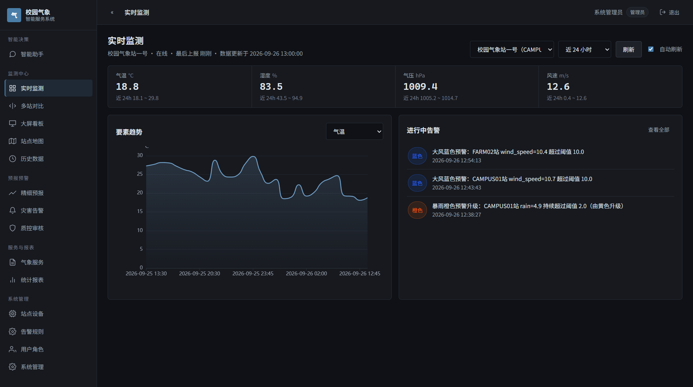
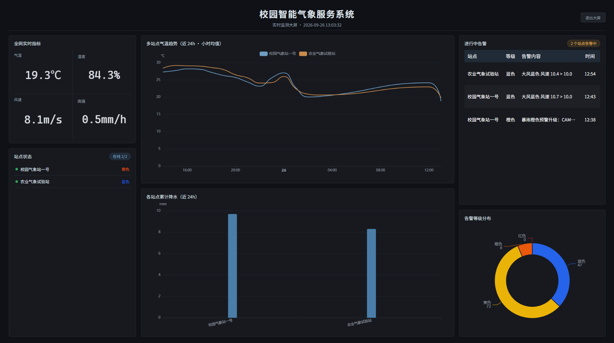
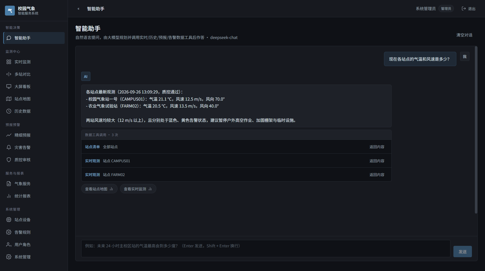

<div class="cover">
  <div class="eyebrow">2026 iCAN 国际大学生创新创业大赛 · 复赛</div>
  <div class="doc-title">校园智能气象服务系统</div>
  <p class="doc-subtitle">多智能体协同的气象数据采集、质控、预报与决策服务</p>
  <div class="rule"></div>
  <div class="doc-meta"><span>应用方案</span><span>软件应用赛道</span><span>2026 年 9 月</span></div>
</div>

<div class="abstract">
  <span class="label">项目摘要</span>
  <p>校园是气象风险的放大器：同样一场短时强降水，在市区只是一次降雨，在校园里却直接对应宿舍区积水、地下车库倒灌与晚自习放学时段的大面积滞留。但现有公共气象服务的空间颗粒度在「市／县」一级，校园既没有自己的观测数据，也拿不到「今天 17 点综合楼一带风最大」这类可直接指导行动的结论。</p>
  <p>本项目构建了一套从设备接入到决策输出的完整气象服务系统。系统以五个<strong>数据智能体</strong>（采集、质控、预报、告警、报表）构成一条消息驱动的数据处理流水线，保证进入系统的每一条观测都可追溯质量状态；在其之上叠加一个<strong>决策智能体</strong>——由大模型通过工具调用读取系统真实数据、通过检索增强读取气象服务知识库，把「数据」直接翻译成值班人员能执行的中文结论。</p>
  <p>方案的工程重心放在 AI 的<strong>可靠性</strong>上：工具全部只读、模型不接触数据库、取不到数据时如实回答而非编造，告警文案生成失败绝不阻塞预警落库。系统已交付 17 个前端功能页面、17 个 REST 控制器与 148 个后端测试方法。</p>
</div>

<div class="toc">
  <span class="label">目录</span>
  <ol>
    <li><b>一、项目背景与痛点分析</b><div class="toc-meta">校园场景特殊性 · 四类痛点 · 项目定位</div></li>
    <li><b>二、需求分析</b><div class="toc-meta">五类用户群体 · 功能需求 · 非功能需求</div></li>
    <li><b>三、开发工具与技术选型</b><div class="toc-meta">工具链 · 技术栈基线 · 选型理由</div></li>
    <li><b>四、技术方案与系统架构</b><div class="toc-meta">七层架构 · 智能体协作 · 关键工程设计</div></li>
    <li><b>五、作品功能说明</b><div class="toc-meta">17 个功能页面 · 分模块能力</div></li>
    <li><b>六、AI 功能的核心作用</b><div class="toc-meta">两类智能体 · 工具调用 · 知识库 · 防幻觉</div></li>
    <li><b>七、使用说明</b><div class="toc-meta">部署启动 · 分角色操作 · 交互指南</div></li>
    <li><b>八、应用前景与商业模式</b><div class="toc-meta">三阶段推广 · 收入结构 · 风险对策</div></li>
  </ol>
</div>

# 一、项目背景与痛点分析

## 1.1 项目背景

我国极端天气事件近年呈频发重发态势，短时强降水、雷暴大风、持续高温对人员密集场所的威胁尤为突出。教育部与气象部门多次要求加强学校气象灾害防御体系建设，而《气象高质量发展纲要（2022—2035 年）》明确提出推进气象服务向精细化、智能化演进。**校园恰好是这两条要求交汇的场景**：它既是高密度人群暴露区，又具备相对独立的边界与责任主体（校方、后勤、宿管、保卫），行动决策链条短、执行反馈快——一旦有了站点级数据与可执行结论，气象服务能立刻转化为具体动作。

从观测条件看，部署校园气象站的技术门槛已经降低：温湿压、风速风向、雨量、辐射、蒸发、能见度等要素的国产传感器均已成熟。**真正的瓶颈不在「测不到」，而在「测到了之后怎么办」**——原始观测直接展示会误报，逐小时人工判读不可持续，而通用天气 App 给不出面向本校的结论。

本项目正是针对这一瓶颈：观测设备由校内其他教师团队研制，本系统承接**从数据接入开始的全部软件侧工作**，把原始报文一步步转化为面向校园管理者的决策依据。

## 1.2 痛点问题

我们在需求调研阶段走访了校园后勤与宿管值班场景，将痛点归为四类：

| 层次 | 痛点现状 | 造成的后果 | 本项目对策 |
|---|---|---|---|
| **数据层** | 公共气象服务颗粒度为市／县级，校园无自有观测数据 | 拿不到「本校此刻」的真实天气，只能凭体感与经验判断 | 部署站点级观测链路，MQTT 秒级接入，站点最新值进入实时接口 |
| **质量层** | 传感器存在缺测、尖峰、漂移；设备离线时数据静默消失 | 原始数据直接可视化会触发误报警；漏报又让人失去信任 | 三类质控检验 + 缺测智能插补 + 全链路幂等去重，每一条数据带质量标记 |
| **服务层** | 通用天气 App 只给「今天有雨」，给不了「几点、哪里、影响谁、该做什么」 | 值班人员拿到信息仍无法决策，服务停在展示层 | 决策智能体：大模型调用真实数据工具作答，并给出影响对象与处置动作 |
| **技术层** | 传感器厂商协议各异；MQTT 断线或订阅丢失是静默故障，不报错也不中断 | 系统「安静地」不再收到数据，运维难以察觉 | 采集链路定时体检自愈，主动重连与重订阅，恢复即刻可验证 |

四类痛点构成一条因果链：**没有数据 → 有了数据不敢用 → 数据可用但问不出结论 → 链路还可能在无声处失效**。本项目的设计目标因此不是做一个「好看的气象看板」，而是打通整条链路，并让最后一环由 AI 承担。

## 1.3 项目定位与目标

系统定位为**校园级气象数据与服务中台**：向下以 MQTT 报文规范对接各类观测设备（与硬件解耦，换设备不改软件），向上以 REST 接口与 Web 界面交付服务，中间由两条智能体链完成从原始数据到决策结论的转化。

<div class="kpi-row">
  <div class="kpi"><b>5</b><span>数据智能体<br>构成处理流水线</span></div>
  <div class="kpi"><b>7</b><span>只读数据工具<br>供大模型规划调用</span></div>
  <div class="kpi"><b>17</b><span>前端功能页面<br>覆盖 5 类角色</span></div>
  <div class="kpi"><b>148</b><span>后端测试方法<br>16 个测试类</span></div>
</div>

# 二、需求分析

## 2.1 目标用户群体

系统面向五类角色，权限按**权限点**（而非角色名）授予，角色只是权限点的集合。这样新增角色时无需改动接口，只需调整授予关系。

| 角色 | 典型用户 | 核心诉求 | 对应能力 |
|---|---|---|---|
| 游客 | 师生、访客 | 知道今天天气如何、是否有预警 | 实时曲线、站点地图、公开预报、气象科普 |
| 普通用户 | 师生、社团 | 查历史、看趋势、订阅关心的站点预警 | 历史查询与统计、多站点对比、告警订阅 |
| 运维人员 | 设备维护方 | 知道哪些设备离线、哪些数据可疑需人工判读 | 站点与设备档案、运维记录、质控审核队列、数据补录 |
| 预报员 | 气象专业师生 | 查看与订正预报、维护告警规则、出统计报表 | 预报产品与检验评分、订正留痕、告警规则、报表生成 |
| 管理员 | 系统管理方 | 管用户权限、管站点、查操作日志 | RBAC 管理、系统参数、操作日志审计 |

五类角色中存在一个关键的**诉求断层**：运维与预报员需要看到「质控标记、检验评分」这类专业字段，而师生只需要一个结论。系统因此对同一份数据提供两种出口——面向专业的图表与队列，以及面向决策的自然语言问答。

## 2.2 功能需求

功能需求按模块编号（`FR-<模块>-<序号>`），优先级 P0 为必须交付、P1 为重要、P2 为可选。

| 模块 | 需求要点 | 优先级分布 |
|---|---|---|
| 实时监测 | 地图站点分布与状态着色、要素仪表盘与实时曲线、多站点对比、离线检测 | P0 ×4、P1 ×1 |
| 数据采集与质控 | MQTT 采集与定时兜底、极值／时间一致性／空间一致性检验、缺测插补、可疑数据人工审核 | P0 ×4、P1 ×2 |
| 精细化预报 | 0–72h 站点级预报、逐小时曲线与降水展示、预报准确率检验、人工订正留痕 | P0 ×2、P1 ×2、P2 ×1 |
| 灾害告警 | 多阈值规则配置、蓝黄橙红分级与持续触发升级、多渠道推送、历史统计、地图可视化 | P0 ×4、P1 ×1 |
| 数据查询与统计 | 多条件组合查询、日／月／年报表、极值统计、数据导出 | P0 ×3、P1 ×1、P2 ×1 |
| 气象服务 | 农业气象提示、出行指数、科普内容发布 | P1 ×2、P2 ×1 |
| 站点与系统管理 | 站点设备档案、运维记录、RBAC、系统参数、操作日志 | P0 ×4、P1 ×1 |

## 2.3 非功能需求

| 维度 | 指标 |
|---|---|
| 性能 | 上报到展示延迟 ≤ 5 秒；单站点单要素 1 年小时数据查询 ≤ 2 秒；支持 ≥ 50 站点并发上报；仪表盘首屏 ≤ 3 秒 |
| 可用性 | 年可用率 ≥ 99.5%；时序数据保留 ≥ 5 年；采集链路故障消息不丢（QoS1 + 本地缓存重发） |
| 安全性 | JWT 无状态认证 + RBAC；密码 BCrypt；防 SQL 注入／XSS／CSRF；公开接口仅放行 GET |
| 可扩展性 | 新增气象要素只需补配置阈值；新增站点即插即用；智能体经消息队列解耦，可独立扩容 |
| 兼容性 | 支持 Chrome／Edge／Firefox 最近两个大版本；移动端 H5 自适应 |

其中两条指标直接决定了后续的架构选择：「上报到展示 ≤ 5 秒」要求推送链路而非轮询；「时序数据保留 ≥ 5 年 + 1 年数据 2 秒内可查」要求时序库与关系库分离存储。

## 2.4 需求落地情况

我们在方案中严格区分「已交付」与「规划中」，避免夸大：

- **已交付**：五条数据智能体链路、决策智能体（工具调用 + 检索增强）、告警 AI 文案生成、17 个前端功能页面、17 个 REST 控制器、148 个后端测试方法。
- **规划中**：GRIB 数值预报产品接入（当前预报由统计降尺度基线模型承担）、短信／微信／邮件推送通道（当前为站内 WebSocket 实时推送 + 页面告警）、农业与旅游气象服务内容运营、`topic.forecast.ready` 事件驱动推送（当前前端定时轮询）。

# 三、开发工具与技术选型

## 3.1 开发工具链

| 环节 | 工具 | 使用说明 |
|---|---|---|
| 开发环境 | Windows 11 / JDK 17 / Node 20 LTS | 前后端统一版本基线，避免环境差异导致的隐性缺陷 |
| 后端构建 | Maven 3.9 + Maven Wrapper | 项目内置 Wrapper，评审机器无需预装 Maven 即可构建 |
| 接口设计与联调 | springdoc-openapi（Swagger UI） | 所有接口带 `@Operation`／`@Schema` 注解，在线可查、可直接调试 |
| 数据库迁移 | Flyway | 建表与种子数据全部版本化（V1–V9），禁止直接改库，保证环境可复现 |
| 单元测试 | JUnit 5 + Mockito | 16 个测试类、148 个测试方法，覆盖质控判定、插补算法、告警升级、气象数据模拟、预报回算与检验等核心逻辑 |
| 前端工程 | Vite + TypeScript + ECharts + 高德地图 + DataV | 类型检查与构建产线化，图表统一封装复用 |
| 中间件环境 | 自研 PowerShell 便携化脚本 + Docker Compose | 开发期免安装一键起停 Redis／InfluxDB／Mosquitto／RabbitMQ，生产用容器编排 |
| 数据模拟 | 自研 `DataSimulator` | 硬件未就绪时生成观测：要素为时刻的连续函数，含日变化、季节与要素耦合；启动时用同一套模型自动回填 7 天历史 |
| 大模型服务 | DeepSeek（对话） + 阿里云百炼通义千问（向量化） | 均走 OpenAI 兼容协议，换厂商只改 base-url 与 model |
| 版本管理 | Git（main／dev／feature 分支 + Conventional Commits） | 功能分支从 dev 切出，评审后合回，提交信息规范化 |

## 3.2 技术栈基线

| 层次 | 组件 | 版本 |
|---|---|---|
| 后端框架 | Spring Boot / Spring Security / MyBatis Plus | 3.5 / 6.5 / 3.5 |
| AI 框架 | Spring AI（OpenAI 兼容协议接入国产大模型） | 1.1.8 |
| 前端 | Vue / Vite / Pinia / ECharts / 高德地图 / DataV | 3.4+ / 5 / 2.x / 5 / 2.0 / 3.x |
| 中间件 | RabbitMQ / Redis / Nginx / EMQX | 3.12 / 7 / 1.24 / 5.7 |
| 数据存储 | MySQL / InfluxDB | 8.0 / 2.7 |
| 观测设备接入 | MQTT 3.1.1（开发 Mosquitto／生产 EMQX） | — |

## 3.3 关键选型理由

**为什么用时序库与关系库分离。** 气象观测是典型的写多读少、按时间范围检索的数据：单站点分钟级数据一年即 52 万点，若与站点档案、用户权限同库，会产生大量无意义的索引维护开销。系统将观测与预报产品放入 InfluxDB（按 `station_code` 建 tag，保留策略分级），业务强一致数据放入 MySQL。这一分工直接在查询侧体现为「时序接口按站点编码查、业务接口按主键查」的约定。

**为什么用消息队列而非直接调用。** 数据智能体之间的处理节奏差异很大：采集是事件驱动、质控需要比对历史窗口、告警需要持续时长判定。若用方法直接调用串联，任一环节变慢都会阻塞采集，且无法单独扩容。五个数据智能体之间只通过 RabbitMQ Topic 通信，**禁止跨智能体直接方法调用**，单点故障被隔离在队列中。

**为什么大模型用 OpenAI 兼容协议接入。** 国产大模型服务迭代快、价格变化频繁，把厂商差异收敛在 `base-url` 与 `model` 两个配置项上，可以在不改一行业务代码的前提下换用其他模型。

**为什么对话与向量化分开用两家厂商。** DeepSeek 只提供对话接口，不提供向量化（实测其 `/v1/embeddings` 返回 404）。若强行用同一家，知识库将无法构建。因此对话走 DeepSeek、向量化走阿里云百炼（`text-embedding-v4`），两者在配置上互相覆盖同名项、互不影响。这也是实际落地中容易踩坑的地方，我们将其记录在接口规范文档中。

# 四、技术方案与系统架构

## 4.1 总体架构

系统采用七层架构，各层之间通过明确定义的接口与消息协议通信，依赖方向自上而下单向流动。

<figure class="fig">
<svg viewBox="0 0 700 336" xmlns="http://www.w3.org/2000/svg" font-family="Microsoft YaHei, sans-serif">
  <defs>
    <marker id="arrowDown" markerWidth="7" markerHeight="7" refX="3.2" refY="6" orient="auto">
      <path d="M0,0 L3.2,6 L6.4,0 z" fill="#8a929c"/>
    </marker>
  </defs>
  <g>
    <text x="2" y="30" font-size="10.5" fill="#5a6472">表现层</text>
    <rect x="78" y="6" width="616" height="38" rx="4" fill="#eef4f9" stroke="#cfe0ee"/>
    <text x="92" y="30" font-size="11" fill="#1f2328">Vue 3.4 + Vite + Pinia ｜ ECharts 5 ｜ 高德地图 ｜ DataV 大屏</text>
    <line x1="386" y1="45" x2="386" y2="51" stroke="#8a929c" stroke-width="1.2" marker-end="url(#arrowDown)"/>
  </g>
  <g>
    <text x="2" y="77" font-size="10.5" fill="#5a6472">Web 应用层</text>
    <rect x="78" y="53" width="616" height="38" rx="4" fill="#eef4f9" stroke="#cfe0ee"/>
    <text x="92" y="77" font-size="11" fill="#1f2328">Spring Boot 3.5 + Spring Security(JWT) ｜ 17 个 REST 控制器 ｜ 15 个业务服务</text>
    <line x1="386" y1="92" x2="386" y2="98" stroke="#8a929c" stroke-width="1.2" marker-end="url(#arrowDown)"/>
  </g>
  <g>
    <text x="2" y="124" font-size="10.5" fill="#5a6472">智能体层</text>
    <rect x="78" y="100" width="616" height="38" rx="4" fill="#e3eef6" stroke="#b7d2e6"/>
    <text x="92" y="124" font-size="11" fill="#1f2328">采集 · 质控 · 预报 · 告警 · 报表 五个数据智能体 ＋ 决策智能体（Spring AI）</text>
    <line x1="386" y1="139" x2="386" y2="145" stroke="#8a929c" stroke-width="1.2" marker-end="url(#arrowDown)"/>
  </g>
  <g>
    <text x="2" y="171" font-size="10.5" fill="#5a6472">业务支撑层</text>
    <rect x="78" y="147" width="616" height="38" rx="4" fill="#eef4f9" stroke="#cfe0ee"/>
    <text x="92" y="171" font-size="11" fill="#1f2328">RabbitMQ 3.12（智能体解耦） ｜ Redis 7（实时缓存／幂等／限流） ｜ Nginx</text>
    <line x1="386" y1="186" x2="386" y2="192" stroke="#8a929c" stroke-width="1.2" marker-end="url(#arrowDown)"/>
  </g>
  <g>
    <text x="2" y="218" font-size="10.5" fill="#5a6472">数据层</text>
    <rect x="78" y="194" width="616" height="38" rx="4" fill="#eef4f9" stroke="#cfe0ee"/>
    <text x="92" y="218" font-size="11" fill="#1f2328">MySQL 8（业务数据） ｜ InfluxDB 2.7（观测与预报时序） ｜ GRIB 数值产品文件</text>
    <line x1="386" y1="233" x2="386" y2="239" stroke="#8a929c" stroke-width="1.2" marker-end="url(#arrowDown)"/>
  </g>
  <g>
    <text x="2" y="265" font-size="10.5" fill="#5a6472">接入层</text>
    <rect x="78" y="241" width="616" height="38" rx="4" fill="#eef4f9" stroke="#cfe0ee"/>
    <text x="92" y="265" font-size="11" fill="#1f2328">采集网关 · MQTT Broker（开发 Mosquitto／生产 EMQX 5） · 自动站协议解析</text>
    <line x1="386" y1="280" x2="386" y2="286" stroke="#8a929c" stroke-width="1.2" marker-end="url(#arrowDown)"/>
  </g>
  <g>
    <text x="2" y="312" font-size="10.5" fill="#5a6472">终端感知层</text>
    <rect x="78" y="288" width="616" height="38" rx="4" fill="#f7f9fb" stroke="#dfe3e9"/>
    <text x="92" y="312" font-size="11" fill="#5a6472">风速风向 · 雨量 · 温湿压 · 辐射 · 蒸发 · 能见度传感器（由硬件团队研制，以报文规范对接）</text>
  </g>
</svg>
<figcaption>图 1　系统七层架构：依赖自上而下单向流动，智能体层是数据与服务的转化中枢</figcaption>
</figure>

## 4.2 智能体协作与数据流转

五个数据智能体构成一条消息驱动的流水线：采集智能体订阅 MQTT 报文并落库，随后投递到 `topic.meteo.raw`；质控智能体消费并写入质量标记，再投递到 `topic.meteo.qc`；告警智能体消费质控后数据做阈值判定与等级升级。预报与报表智能体不参与这条实时链路——前者定时（逐小时）读取実况与数值产品生成预报，后者定时（日／月／年）聚合历史数据出报表，各自独立、互不阻塞。

<figure class="fig">
<svg viewBox="0 0 700 214" xmlns="http://www.w3.org/2000/svg" font-family="Microsoft YaHei, sans-serif">
  <defs>
    <marker id="arrowRight" markerWidth="7" markerHeight="7" refX="6" refY="3.2" orient="auto">
      <path d="M0,0 L6,3.2 L0,6.4 z" fill="#5a6472"/>
    </marker>
    <marker id="arrowDash" markerWidth="7" markerHeight="7" refX="3.2" refY="6" orient="auto">
      <path d="M0,0 L3.2,6 L6.4,0 z" fill="#8aa9c4"/>
    </marker>
  </defs>

  <g font-size="11" fill="#1f2328" text-anchor="middle">
    <rect x="0" y="34" width="92" height="44" rx="4" fill="#f7f9fb" stroke="#dfe3e9"/>
    <text x="46" y="52">气象传感器</text>
    <text x="46" y="68" font-size="8.5" fill="#8a929c">分钟级上报</text>

    <rect x="116" y="34" width="100" height="44" rx="4" fill="#f7f9fb" stroke="#dfe3e9"/>
    <text x="166" y="52">采集网关</text>
    <text x="166" y="68" font-size="8.5" fill="#8a929c">MQTT Broker</text>

    <rect x="240" y="34" width="100" height="44" rx="4" fill="#e3eef6" stroke="#b7d2e6"/>
    <text x="290" y="52">采集智能体</text>
    <text x="290" y="68" font-size="8.5" fill="#5a6472">解析·归一·落库</text>

    <rect x="364" y="34" width="100" height="44" rx="4" fill="#e3eef6" stroke="#b7d2e6"/>
    <text x="414" y="52">质控智能体</text>
    <text x="414" y="68" font-size="8.5" fill="#5a6472">三类检验·插补</text>

    <rect x="488" y="34" width="100" height="44" rx="4" fill="#e3eef6" stroke="#b7d2e6"/>
    <text x="538" y="52">告警智能体</text>
    <text x="538" y="68" font-size="8.5" fill="#5a6472">判定·升级·分发</text>

    <rect x="612" y="34" width="88" height="44" rx="4" fill="#f7f9fb" stroke="#dfe3e9"/>
    <text x="656" y="52">前端／推送</text>
    <text x="656" y="68" font-size="8.5" fill="#8a929c">WebSocket</text>
  </g>

  <g stroke="#5a6472" stroke-width="1.3">
    <line x1="94" y1="56" x2="112" y2="56" marker-end="url(#arrowRight)"/>
    <line x1="218" y1="56" x2="236" y2="56" marker-end="url(#arrowRight)"/>
    <line x1="342" y1="56" x2="360" y2="56" marker-end="url(#arrowRight)"/>
    <line x1="466" y1="56" x2="484" y2="56" marker-end="url(#arrowRight)"/>
    <line x1="590" y1="56" x2="608" y2="56" marker-end="url(#arrowRight)"/>
  </g>
  <g font-size="9" fill="#8a929c" text-anchor="middle">
    <text x="103" y="26">①</text>
    <text x="227" y="26">②</text>
    <text x="351" y="26">③</text>
    <text x="475" y="26">④</text>
    <text x="599" y="26">⑤</text>
  </g>

  <g stroke="#8aa9c4" stroke-width="1.1" stroke-dasharray="3,2.5">
    <line x1="290" y1="80" x2="130" y2="106" marker-end="url(#arrowDash)"/>
    <line x1="414" y1="80" x2="340" y2="106" marker-end="url(#arrowDash)"/>
    <line x1="538" y1="80" x2="570" y2="106" marker-end="url(#arrowDash)"/>
  </g>

  <g font-size="9.5">
    <rect x="20" y="108" width="200" height="54" rx="4" fill="#fff" stroke="#b7d2e6"/>
    <text x="32" y="124" font-weight="700" fill="#245a80">InfluxDB 2.7　观测与预报时序</text>
    <text x="32" y="139" font-size="8.5" fill="#5a6472">obs_min / obs_hour / fcst</text>
    <text x="32" y="153" font-size="8.5" fill="#5a6472">按 station_code 建 tag，保留策略分级</text>

    <rect x="250" y="108" width="180" height="54" rx="4" fill="#fff" stroke="#b7d2e6"/>
    <text x="262" y="124" font-weight="700" fill="#245a80">Redis 7　实时与协调</text>
    <text x="262" y="139" font-size="8.5" fill="#5a6472">最新质控后观测缓存（24h）</text>
    <text x="262" y="153" font-size="8.5" fill="#5a6472">msgId 幂等 · 令牌桶限流</text>

    <rect x="460" y="108" width="220" height="54" rx="4" fill="#fff" stroke="#b7d2e6"/>
    <text x="472" y="124" font-weight="700" fill="#245a80">MySQL 8　业务数据</text>
    <text x="472" y="139" font-size="8.5" fill="#5a6472">qc_review_task · alert_record</text>
    <text x="472" y="153" font-size="8.5" fill="#5a6472">站点·设备·规则·用户·报表记录</text>
  </g>

  <g font-size="8.5" fill="#8a929c">
    <text x="20" y="184">① MQTT QoS1 上行（topic：meteo/+/up）　② topic.meteo.raw　③ topic.meteo.qc　④ topic.alert.trigger　⑤ 实时推送</text>
    <text x="20" y="200">预报智能体（逐小时定时）与报表智能体（日／月／年定时）独立读时序库，不经消息队列；决策智能体仅经只读工具读取上述存储。</text>
  </g>
</svg>
<figcaption>图 2　数据流转链路与存储落点：五段消息驱动 + 三类存储分工</figcaption>
</figure>

## 4.3 数据存储分工

| 存储 | 存放内容 | 设计要点 |
|---|---|---|
| InfluxDB 2.7 | 分钟／小时观测（`obs_min`／`obs_hour`）、预报产品（`fcst`） | 以 `station_code` 为 tag，`qc_flag` 标记质量状态；`obs_min` 保留 5 年、`obs_hour` 10 年、`fcst` 1 年 |
| MySQL 8 | 站点与设备档案、用户权限、告警规则与记录、质控审核任务、报表记录、操作日志 | 全部含逻辑删除与自动填充；建表经 Flyway 版本化管理 |
| Redis 7 | 最新质控后观测缓存、`msgId` 幂等键、接口限流计数、分布式锁 | 缓存 24 小时过期，供仪表盘高频读取；幂等键保证消费端重复投递不产生脏数据 |
| GRIB 文件存储 | 数值预报模式原始产品 | 文件级管理，路径入库索引（当前为规划项） |

**质量状态如何随数据流动。** 质控标签取值 `raw / passed / suspect / interpolated / revised`，以「新增 point + 不同 tag」的语义写入，查询时按 `revised > passed > interpolated > raw` 的优先级取值。这一设计的价值在于：**任何一条数据都能回答「它是原始上报的，还是被质控接受、被插补、或被人工修正的」**，而这是气象数据可信度的基础。

## 4.4 关键工程设计

**① 采集链路的静默失效自愈。** MQTT 的失败是静默的——断线或订阅丢失都不报错，系统只是慢慢收不到数据。采集智能体定时体检两种情形：未连接时等待自动重连、超阈值则主动重连；连接正常但长时间收不到任何上行消息时，判定订阅可能失效并主动重订阅。**关键细节**：静默判定仅在此前确实收到过消息时启用——从未收到消息时无法区分「没有站点在上报」与「订阅失效」，开发环境中模拟器直接调用处理逻辑、不经 MQTT，正属此情形，因此不会误报。

**② 三类质控检验。** 极值检验按要素物理／气候极值判定；时间一致性检验比对要素变化率，其**比较基准取「最近一个被质控接受的值」而非原始值**——若把原始值纳入基准，一次被拒绝的尖峰将污染其后的正常观测，形成连环误判；空间一致性检验取最近站点（Haversine 距离，上限 50 km）的同时刻（容差 300 秒）值比对。风向为圆周量，不参与偏差判定。三类检验的阈值统一读系统参数表，未配置的要素不检查，新增要素只需补一条阈值。

**③ 缺测插补与「只补物理缺测」原则。** 插补由质控智能体内的定时扫描承担。采集间隔不写死，而是由数据自身推断（取中位数并做 5–300 秒钳制），以适应开发环境 15 秒、生产环境 60 秒的差异；缺口不超过 2 个槽位走线性插值，超过则回退邻近站点回归（最近站点值 + 两站偏差订正，距离上限 50 km、配对样本下限 10），超过 30 个槽位直接放弃。**最重要的一条约束是：只补物理缺测**——某槽位若已存在任意质量标记的数据（含原始值、可疑值），即视为设备确实上报过，不做覆盖；插补锚点只取质控通过或人工修正的值，插补点本身不参与后续插补。插补结果写入时序库并标记 `interpolated`，**不投放消息队列**，因此不会进入告警链路，也不会抬高预报准确率评分。

**④ 消费端幂等。** 采集先落库再投递消息，MQ 至少一次投递语义下必然出现重复。消费端以 `msgId` + Redis 去重，保证重复投递不产生重复告警或重复质控任务；消息手动 ack，异常重试 3 次后进入死信队列并告警。

**⑤ 时序聚合的边界对齐。** 多站点趋势与降水累计走服务端按小时聚合。聚合查询必须把结束时间对齐到窗口边界，否则末尾会出现「半个窗口」的残窗，累计降水口径随之偏小。这一缺陷在评审前的自测中被定位并修复，测试类中保留了 5 个针对该边界的用例。

# 五、作品功能说明

## 5.1 功能全景

系统共交付 17 个功能页面，覆盖五类角色的全部核心场景：

| 页面 | 面向角色 | 核心能力 |
|---|---|---|
| 实时监测 | 全部 | 站点选择、四要素读数条、要素趋势曲线（近 6／24／72 小时）、进行中告警列表，30 秒自动刷新 |
| 站点地图 | 公开 | 高德地图站点分布，按在线／告警状态着色，点击查看站点详情 |
| 多站点对比 | 登录用户 | 同要素多站点并列曲线，服务端按时间轴并集对齐、缺测补空（单次上限 6 站／7 天） |
| 历史查询 | 全部 | 多要素组合查询，粒度自动／分钟／小时／日切换，质量标记过滤 |
| 预报产品 | 全部 | 0–72 小时逐小时预报曲线、多模型对比、预报准确率检验评分（MAE／RMSE／降水 TS） |
| 告警中心 | 用户及以上 | 告警历史分页与统计（按类型／等级／站点）、手动解除、订阅管理 |
| 智能助手 | 登录用户 | 自然语言问答，大模型调用真实数据工具作答并展示调用留痕 |
| 质控审核 | 运维／预报员 | 可疑数据队列，确认／修正／作废三态处理，手动触发一轮缺测插补 |
| 气象服务 | 公开 | 气象服务文章发布与浏览，作为知识库语料来源 |
| 统计报表 | 登录用户 | 日／月／年报表生成与下载，极值统计与气候均值对比 |
| 数据导出 | 预报员及以上 | 异步导出 Excel／CSV／TXT，任务状态可查、完成后下载 |
| 实时监测大屏 | 展厅／值班 | 全网指标、站点态势、多站温度趋势、降水排行、告警榜单、等级分布 |
| 站点管理 | 运维 | 站点与设备档案、运维记录 |
| 告警规则管理 | 预报员 | 多阈值规则配置、等级与升级策略、推送渠道 |
| 用户管理 | 管理员 | 用户增改、角色分配、启禁用 |
| 系统管理 | 管理员 | 系统参数、操作日志审计、角色权限配置 |
| 登录 / 403 | 全部 | JWT 登录、按角色路由守卫与越权拦截 |

## 5.2 分模块能力说明

**实时监测。** 页面以「读数条 + 趋势图 + 告警列表」三段式组织。读数条给出四要素的当前值与近 N 小时极值区间，让值班人员一眼看到「现在多少、这个范围正不正常」；趋势图支持要素切换与粒度选择。数据来自质控后的实时通道，页面每 30 秒自动刷新，也可手动触发。

<figure class="fig">

<figcaption>图 3　实时监测页面：读数条给出四要素当前值与近 24 小时极值区间，右侧同步列出进行中告警</figcaption>
</figure>

**多站点对比。** 对比的价值在于发现局地差异（例如同一时刻东区与西区的温差）。实现难点是**时间轴对齐**：不同站点的上报时刻并不严格一致，因此服务端取各站点时间戳的并集作为公共时间轴，缺测位置补空值，前端按空值断线绘制。单次请求限制 6 站、7 天跨度，避免一次对比拖垮时序库。

**预报产品。** 系统生成 0–72 小时逐小时预报，支持统计降尺度、机器学习、人工订正三种来源的模型对比。准确率检验将预报与**仅观测值**（排除插补值）逐时次配对，计算 MAE、RMSE 与降水 TS 评分，并以回算接口重演历史预报以补充检验样本。

**告警中心。** 告警记录拆成两段文案：`content` 由规则模板生成，只交代事实（站点、要素、触发值、阈值），必定有值、可机读；`aiContent` 由大模型生成，面向值班人员给出影响对象与可执行动作。**两者分列存放，是为了能分辨「哪句是规则说的、哪句是模型写的」。** 这一点在事后追责与规则调优时非常关键。

**质控审核。** 三类检验产出的可疑数据进入审核队列，运维可就地确认有效、填入修正值或作废。修正值以 `revised` 标记回写时序库，并在后续查询中优先取值。

**大屏。** 面向展厅与值班室，按 1920×1080 基准分辨率等比缩放，保证投影与展厅环境下比例不失真。采用仪器面板语言——读数用等宽字体、面板与后台卡片同款，颜色只留给告警等级编码，不做装饰性光效。

<figure class="fig">

<figcaption>图 4　实时监测大屏：全网指标、站点态势、多站气温趋势、累计降水、进行中告警与等级分布集中于一屏</figcaption>
</figure>

# 六、AI 功能的核心作用

## 6.1 两类智能体：把确定性交给算法，把不确定性交给大模型

本项目最核心的设计判断，是**不把所有「智能」都塞给大模型**。系统中存在两类性质完全不同的智能体：

| 维度 | 数据智能体（采集／质控／预报／告警／报表） | 决策智能体（助手） |
|---|---|---|
| 驱动方式 | 规则、阈值与统计算法 | 大模型 + 工具调用 + 检索增强 |
| 运行模式 | 消息驱动流水线，7×24 不间断 | 用户提问触发，一次一答 |
| 输出 | 结构化数据、质量标记、告警记录 | 自然语言结论，附调用留痕 |
| 失败代价 | 数据不准或漏报，影响面大 | 一次回答不佳，可重新提问 |
| 可解释性 | 完全确定，可复算 | 依赖提示词约束与工具返回 |

这一分工带来两个直接收益：**其一，最关键的实时链路不依赖外部大模型服务**——DeepSeek 或百炼任何一方不可用时，采集、质控、告警、报表全部照常运行，校园预警不会因为一次 API 超时而中断；**其二，大模型只在它真正擅长的地方介入**——把结构化数据翻译成人能读、能执行的结论，以及处理「哪个站点风速最大」这类无法预先穷举规则的自然语言问题。

## 6.2 决策智能体的实现方式

决策智能体不使用「把全部数据塞进提示词」的做法，而是让模型**按需调用工具**。工程上由三部分构成：

- **工具调用**：`MeteoTools` 把系统的实时、历史、预报、告警、站点与知识库能力以**只读工具**暴露给模型，由模型自行规划调用顺序。所有工具内部委托既有业务服务，不新增任何数据访问逻辑——模型不接触数据库，只能看到服务层愿意返回的内容。
- **知识库检索**：语料为「气象服务」中已发布的文章（预警信号发布标准、防灾避险指引、农业与出行建议），切块向量化后存入进程内向量库。**检索以工具形式暴露，而非每轮强制注入上下文**——「这一轮到底查没查知识库」在对话记录里是可见的，同时避免无关问答被塞入噪声。
- **结果留痕**：每轮实际调用的工具及其参数、返回值按顺序记入响应体的 `tools[]` 字段，前端直接展示「AI 查了什么、拿到了什么」。这让 AI 的回答从「不可验证」变为「可核查」。

<figure class="fig">
<svg viewBox="0 0 700 268" xmlns="http://www.w3.org/2000/svg" font-family="Microsoft YaHei, sans-serif">
  <defs>
    <marker id="seqRight" markerWidth="7" markerHeight="7" refX="6" refY="3.2" orient="auto">
      <path d="M0,0 L6,3.2 L0,6.4 z" fill="#2f6f9f"/>
    </marker>
    <marker id="seqLeft" markerWidth="7" markerHeight="7" refX="1" refY="3.2" orient="auto">
      <path d="M6,0 L0,3.2 L6,6.4 z" fill="#5a6472"/>
    </marker>
  </defs>

  <g font-size="10" text-anchor="middle">
    <rect x="10" y="6" width="130" height="28" rx="4" fill="#eef4f9" stroke="#cfe0ee"/>
    <text x="75" y="24" fill="#245a80">用户 / 前端</text>
    <rect x="180" y="6" width="130" height="28" rx="4" fill="#e3eef6" stroke="#b7d2e6"/>
    <text x="245" y="24" fill="#245a80">决策智能体</text>
    <rect x="370" y="6" width="130" height="28" rx="4" fill="#eef4f9" stroke="#cfe0ee"/>
    <text x="435" y="24" fill="#245a80">大模型</text>
    <rect x="550" y="6" width="130" height="28" rx="4" fill="#eef4f9" stroke="#cfe0ee"/>
    <text x="615" y="24" fill="#245a80">只读工具</text>
  </g>

  <g stroke="#cfe0ee" stroke-width="1" stroke-dasharray="3,3">
    <line x1="75" y1="34" x2="75" y2="252"/>
    <line x1="245" y1="34" x2="245" y2="252"/>
    <line x1="435" y1="34" x2="435" y2="252"/>
    <line x1="615" y1="34" x2="615" y2="252"/>
  </g>

  <g font-size="8.5" fill="#5a6472" text-anchor="middle">
    <text x="160" y="52">① 提问：昨天哪个站点风速最大？</text>
    <text x="340" y="76">② 系统提示词 + 工具定义</text>
    <text x="340" y="100">③ 返回：调用 queryHistory</text>
    <text x="430" y="124">④ 执行只读工具（委托既有服务）</text>
    <text x="430" y="148">⑤ 统计摘要 / 无数据的明确提示</text>
    <text x="340" y="172">⑥ 回填工具返回结果</text>
    <text x="340" y="196">⑦ 生成自然语言结论</text>
    <text x="160" y="220">⑧ answer + source + tools[] 留痕</text>
  </g>

  <g stroke-width="1.3">
    <line x1="75" y1="56" x2="241" y2="56" stroke="#2f6f9f" marker-end="url(#seqRight)"/>
    <line x1="245" y1="80" x2="431" y2="80" stroke="#2f6f9f" marker-end="url(#seqRight)"/>
    <line x1="435" y1="104" x2="249" y2="104" stroke="#5a6472" marker-end="url(#seqLeft)"/>
    <line x1="245" y1="128" x2="611" y2="128" stroke="#2f6f9f" marker-end="url(#seqRight)"/>
    <line x1="615" y1="152" x2="249" y2="152" stroke="#5a6472" marker-end="url(#seqLeft)"/>
    <line x1="245" y1="176" x2="431" y2="176" stroke="#2f6f9f" marker-end="url(#seqRight)"/>
    <line x1="435" y1="200" x2="249" y2="200" stroke="#5a6472" marker-end="url(#seqLeft)"/>
    <line x1="241" y1="224" x2="79" y2="224" stroke="#5a6472" marker-end="url(#seqLeft)"/>
  </g>

  <g>
    <rect x="10" y="236" width="670" height="26" rx="3" fill="#f7f9fb" stroke="#dfe3e9"/>
    <text x="20" y="253" font-size="8.5" fill="#5a6472">大模型全程不接触数据库；工具异常与「无数据」均转为明确的中文提示返回给模型，避免模型改用常识值编造气象数值。</text>
  </g>
</svg>
<figcaption>图 5　决策智能体一次问答的完整链路：工具由模型自主规划调用，全过程留痕可核查</figcaption>
</figure>

<figure class="fig">

<figcaption>图 6　智能助手实际问答：提问、回答与「数据工具调用」清单同屏。本轮模型自行规划并调用了 3 次工具（站点清单 + 两次实时观测），回答中的每个数值都能在清单里核对来源</figcaption>
</figure>

## 6.3 大模型可调用的只读工具

| 工具 | 能力 | 底层服务 |
|---|---|---|
| `listStations` | 站点编码、名称、在线状态、当前最高告警等级 | 站点服务 |
| `queryRealtime` | 站点最新质控后观测（含质控标记） | 实时服务 |
| `queryHistory` | 历史观测统计摘要（样本数／均值／极值／最新），支持中文要素名，跨度上限 7 天 | 数据查询服务 |
| `queryForecast` | 未来 1–72 小时多模型预报曲线的时次范围与极值 | 预报服务 |
| `queryAlerts` | 最近告警记录（等级／站点／触发值／状态），回溯上限 168 小时 | 告警服务 |
| `getStationInfo` | 站点档案详情（区划／经纬度／海拔／类型／状态） | 站点服务 |
| `searchKnowledge` | 知识库检索：预警信号发布标准、防灾避险指引、农业与出行建议 | 知识库服务 + 向量库 |

七个工具全部只读，且都带**参数上限**（跨度 7 天、回溯 168 小时、预报 72 小时）。这不只是防御性编程：大模型完全可能提出「查询最近十年所有站点全部要素」这类请求，若不加约束，一次问答就能拖垮时序库。

## 6.4 AI 的可靠性设计：如何让模型不编造气象数值

面向决策的 AI 系统，最大的风险不是答不出来，而是**答得流畅但错误**。气象数值一旦被编造，会被值班人员当作真实观测采信，后果比「系统无响应」严重得多。项目为此设置了三层约束：

| 风险 | 工程对策 | 失效时的表现 |
|---|---|---|
| 模型拿不到数据却用常识值补全 | 工具异常与「无数据」都转为明确的中文提示返回，提示词明确禁止引入未提供的数值 | 回答「未检索到相关观测数据」，而非给一个看似合理的温度 |
| 模型谎称查过知识库 | 检索以工具形式暴露，调用记录进 `tools[]`，前端可见 | 「查了没有」在界面上可核查，无法伪装 |
| 知识库不可用（缺密钥／向量化失败） | 知识库标记为未就绪，检索工具如实返回「知识库不可用」 | 模型改用自己的常识作答的路径被切断 |
| 大模型服务整体故障 | 助手返回 `source=unavailable` 的提示而非报错 | 页面给出可读提示，实时链路不受任何影响 |
| 告警文案生成失败拖累预警 | `aiContent` 生成失败返回空值并回退模板文案，预警**同步落库** | 预警照常送达，只是缺一段处置建议 |

其中最后一条的设计取舍值得说明：告警文案的生成与判定**同步完成而非异步**。异步化虽然能降低响应耗时，但会让「已经推送出去的文案」与「记录里存的文案」长期不一致；而预警的价值恰恰在于即时送达，因此宁可让告警判定承受一次模型调用的耗时，也要保证文案一致。

## 6.5 AI 的真实价值：从「数据」到「决策」的那一步

系统在引入决策智能体之前，值班人员要回答「昨天哪个站点风速最大」这个问题，需要：进入历史查询 → 选择站点 → 选择要素 → 设定时间范围 → 逐站查看 → 人工比较。站点数量越多，步骤越繁琐，且无法跨要素提问。引入后，一次自然语言提问即可得到结论，且答案附带了调用留痕与数据来源。

更关键的是**服务形态的变化**：面向专业用户的图表并未被替代（预报员仍需要看曲线与检验评分），但面向师生的入口从「一张需要解读的图」变成了「一句可以直接执行的话」——这是气象服务从展示走向决策的实质一步，也是本项目把 AI 放在核心位置的原因。

# 七、使用说明

## 7.1 运行环境与启动

| 项 | 要求 |
|---|---|
| 操作系统 | Windows 10／11（开发环境），Linux（容器化部署） |
| 运行时 | JDK 17、Node 20 LTS；项目内置 Maven Wrapper，无需预装 Maven |
| 中间件 | MySQL 8、InfluxDB 2.7、Redis 7、RabbitMQ 3.12、MQTT Broker |
| 端口占用 | 8080（后端）、5173（前端）、3306／8086／6379／5672／1883 |

开发环境提供便携化脚本，无需 Docker 即可完成环境搭建：

```
scripts/setup-middleware.ps1   # 一次性下载并配置 Redis / InfluxDB / Mosquitto / RabbitMQ
scripts/start-all.ps1          # 一键启动全部中间件与后端服务
scripts/stop-all.ps1           # 一键停止
scripts/clear-timeseries.ps1   # 清空时序库；重启后端会用同一套模型自动回填 7 天历史
frontend: npm install && npm run dev   # 启动前端开发服务器
```

## 7.2 首次使用流程

1. **启动环境**：执行 `scripts/start-all.ps1`，脚本会自行读取密钥文件并注入子进程（密钥不落库、不进代码）。
2. **历史数据自动补齐**：无需手工灌数——后端启动时会用与实时链路**相同的物理模型**按整点补齐 7 天内缺失的逐小时观测（库中已有的时次不重写），趋势图与统计报表直接有数据；停机造成的空洞也会在下次重启时补上。若需重置，执行 `scripts/clear-timeseries.ps1` 后重启即可。
3. **访问登录**：浏览器打开前端地址，使用管理员账号登录。
4. **首次确认数据链路**：进入「实时监测」页，确认读数条有值且趋势图有曲线；若为空，检查 MQTT Broker 与站点上报状态。
5. **体验核心功能**：进入「智能助手」页，提一个问题（例如「昨天哪个站点风速最大？」），观察回答与工具调用留痕。

## 7.3 分角色操作流程

| 角色 | 操作路径 | 关键动作 |
|---|---|---|
| 师生（游客） | 直接进入实时监测／站点地图／气象服务 | 无需登录即可查看公开数据；注册后可订阅站点预警 |
| 普通用户 | 登录 → 历史查询 → 多站点对比 → 告警中心 | 组合条件查询、导出受限、订阅告警 |
| 运维人员 | 登录 → 站点管理 → 质控审核 | 查看设备离线与运维记录；处理可疑数据队列（确认／修正／作废） |
| 预报员 | 登录 → 预报产品 → 告警规则管理 → 统计报表 | 查看检验评分并订正预报（留痕）；维护阈值与升级策略；生成报表 |
| 管理员 | 登录 → 系统管理 → 用户管理 | 配置系统参数（采集频率、离线阈值、质控阈值）；分配角色权限；审计操作日志 |

## 7.4 智能助手交互指南

助手页面输入自然语言问题即可，回答下方同步展示本轮调用的工具与耗时。提问质量直接决定回答质量，建议按下表方式组织问题：

| 想问什么 | 推荐问法 | 说明 |
|---|---|---|
| 某站当前情况 | 「CAMPUS01 现在的温湿度和风速是多少？」 | 指定站点编码或名称，触发实时工具 |
| 极端值排查 | 「昨天哪个站点风速最大？」 | 触发站点清单 + 历史统计，跨站点比较 |
| 趋势与对比 | 「近三天各站点的平均气温分别是多少？」 | 明确时间跨度与要素，便于工具按上限取数 |
| 预报查询 | 「未来 24 小时会有降水吗？」 | 触发预报工具，返回时次范围与极值 |
| 预警依据 | 「暴雨红色预警的发布标准是什么？」 | 触发知识库检索，回答会注明来源标题 |
| 站点档案 | 「CAMPUS01 的海拔和经纬度是多少？」 | 触发站点档案工具 |

交互有三点需要了解：其一，工具调用**只读**，助手无法修改任何数据，不会因提问而误操作系统；其二，若问题超出七个工具的能力范围（例如询问与系统无关的常识），助手会说明依据不足而非强行作答；其三，助手回答中的气象数值均来自系统内真实数据，可通过留痕核对。

## 7.5 演示数据与评审注意事项

评审环境若无法接入真实传感器，可启用内置数据模拟器：要素是「时刻的连续函数」，含日变化（气温 15 时最高、辐射夜间严格为 0）、季节变化与要素耦合（湿度与气温反相；云量同时削减辐射、降低气压、抬升风速），保证同一区域各站点既高度相关又不雷同、趋势自然。启动时还会用同一套模型自动回填 7 天逐小时历史，因此历史与实时数据之间不存在模型差异导致的衔接跳变。模拟器直接调用采集处理逻辑，不经 MQTT，因此不会触发采集链路的静默失效告警。

# 八、应用前景与商业模式

## 8.1 应用前景

**近期（校园场景）：** 我国高校数量众多且普遍具备独立的管理边界与责任主体，校园气象服务的落地阻力小、见效快。系统的价值不只在预警——日常的体育课安排、户外活动审批、宿舍晾晒提示、通勤建议都可直接受益。高校之间的示范效应明显，同类院校容易复制。

**中期（农业气象）：** 农业试验站与校园站在技术形态上高度相似：均为小范围、多要素、需要长时序记录的场景。系统只需替换告警规则与知识库语料，即可服务作物生长期预报与病虫害气象条件提示。**架构上无需改动，只改配置。**

**远期（区域气象服务）：** 系统的采集、质控、插补与报表能力具有通用性，可作为区域气象部门的数据质控与展示中台，或将决策智能体作为既有业务系统的自然语言入口。

## 8.2 商业模式

| 收入来源 | 面向对象 | 价值主张 | 定价思路 |
|---|---|---|---|
| 软件订阅 | 高校、中小学、农业试验站 | 按站点数与功能模块订阅，含系统更新与远程支持 | 按站点数分档年费 |
| 部署与运维服务 | 缺乏 IT 运维能力的单位 | 私有化部署、数据迁移、日常运维托管 | 一次性部署费 + 年度运维费 |
| 定制开发 | 有特殊要素或流程需求的单位 | 新增要素、对接既有平台、定制报表 | 按项目报价 |
| 硬件配套分成 | 通过观测设备厂商渠道 | 软件随硬件免费交付，提升硬件竞争力 | 与硬件厂商按套分成 |
| 技术支持与培训 | 使用单位 | 值班人员培训、应急预案编制 | 按次或按年 |

商业模式的落点在于**以软件订阅为基本盘，以硬件配套分成获取规模**。硬件厂商的痛点是设备卖出后缺乏软件服务能力，本项目恰好补齐这一环，因此通过硬件渠道获客的成本显著低于直接面向学校销售。

## 8.3 推广路径

**第一阶段：单校验证。** 在本校完成部署并稳定运行一个完整汛期，沉淀真实的质控与告警数据，形成可量化的效果材料（如预警提前量、误报率、值班工作量下降比例）。

**第二阶段：同类复制。** 以「标准化部署包 + 便携化环境脚本」降低部署门槛，优先在同城高校与农业试验站推广，重点解决数据迁移与本地化配置问题。

**第三阶段：渠道合作。** 与观测设备厂商、区域气象服务商建立合作，将软件作为硬件方案的组成部分交付，借助渠道完成规模化。

## 8.4 风险与对策

| 风险 | 影响 | 对策 |
|---|---|---|
| 大模型服务不可用或涨价 | 决策智能体与告警文案受影响 | 实时链路完全不依赖大模型；模型经 OpenAI 兼容协议接入，可低成本切换厂商 |
| 模型输出不准确 | 误导值班决策 | 工具只读且带参数上限；回答附调用留痕；无数据时如实说明而非编造 |
| 观测设备稳定性不足 | 数据缺测影响服务 | 三类质控 + 缺测插补 + 离线检测；插补数据单独标记，不参与告警与评分 |
| 评审或客户对数据来源存疑 | 影响信任 | 质量标记贯穿全链路，任何数值都可溯源到「原始／通过／插补／修正」 |
| 缺乏气象专业人才 | 预报与阈值配置质量不足 | 预报采用统计基线模型降低门槛；阈值参数化配置，由业务方按经验调整 |

<div class="closing">
校园智能气象服务系统 · 应用方案　｜　2026 iCAN 国际大学生创新创业大赛
</div>

<!--
================================================================================
本文件是「参赛材料-应用方案」的 Markdown 源文件（以下为生成说明，不会出现在 PDF 里）
================================================================================

渲染链路
  Markdown → markdown-it → HTML → puppeteer-core 驱动 Edge 无头打印 → A4 PDF

重新出片的步骤
  1. 在任意临时目录安装依赖（不必装进本仓库，也无需提交）：
       npm install markdown-it puppeteer-core
  2. 准备渲染脚本 render.js（读入 md，套用 print.css，输出 A4 PDF）与样式表 print.css。
     脚本需指定浏览器可执行文件，本机为：
       C:\Program Files (x86)\Microsoft\Edge\Application\msedge.exe
  3. 执行：
       node render.js "docs\参赛材料-应用方案.md" "docs\参赛材料-应用方案.pdf"
     脚本会顺带报告页数、超框元素与每张插图的截图，便于快速回归检查。

三个已知坑（都实际踩过）
  1. figure 块内不能留空行。
     markdown-it 的 raw HTML 块在空行处终止。SVG 里为分段可读而留的空行，会让其后的
     <rect>/<text> 被当成正文渲染成一整片源码文字（本文图 2 曾整块渲染成文本）。
     渲染脚本已加预处理折叠 figure 内的空行，但手写新图时仍建议不留空行。
  2. 插图必须内联为 data URI。
     page.setContent() 的文档源是 about:blank，Chrome 会拦截其中的 file:// 子资源，
     因此不能用相对或绝对文件路径引图。渲染脚本会把 img 标签的相对 src 自动转 base64，
     路径按「相对本 md 所在目录」解析。
  3. 溢出体检的视口宽度要取「打印内容宽度」而非整页宽度。
     A4 宽 210mm 减去左右各 16mm 页边距 = 674px（按 96dpi 折算）。若按整页 794px 去量，
     整篇都会误报超框，检查就失效了。

版面参数
  A4；页边距 上 15mm / 右 16mm / 下 14mm / 左 16mm；正文 10pt，行高 1.78；
  一级标题强制另起一页（break-before: page）；表格、插图、提示块避免跨页断开；
  页脚右侧显示「第 X 页 / 共 Y 页」。
  赛事上限 20 页，当前成品 19 页 —— 留量不多，若再加内容需重新核对页数。

插图资源（在 ./参赛材料-应用方案.assets/，文件名与正文图号对应）
  01-dashboard.png → 图 3（实时监测页面）
  02-screen.png    → 图 4（实时监测大屏）
  03-assistant.png → 图 6（智能助手实际问答）
  三张均为 2026-09-26 在本地运行的系统上实拍，数据为真实观测值。
  曾拍过一张「精细预报」截图（04-forecast.png）未采用：图内多模型对比与准确率检验
  显示「尚未加载 / 尚未计算」空态，放入参赛材料会显得功能未完成，故弃用。
================================================================================
-->